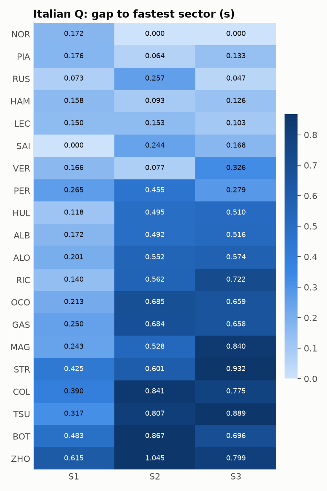
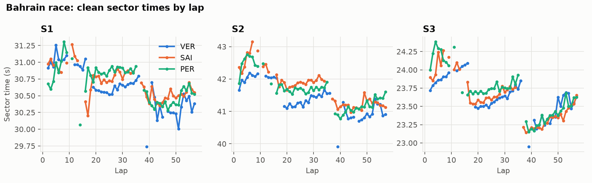

# F1 Sector Analysis

A Python pipeline built on [FastF1](https://github.com/theOehrly/Fast-F1) that pulls official Formula 1 timing data, cleans it, and compares sector times across drivers and sessions. The output is a set of tidy CSVs that feed a Tableau workbook for exploration, plus static charts for a quick look.



## What it does

1. **Load** laps for any set of events and sessions (practice, sprint, qualifying, race) through FastF1, with a local cache so reruns are offline.
2. **Clean** every lap. Nothing is silently dropped: each lap gets an `ExcludeReason` so exclusions can be audited and filtered.
3. **Aggregate** per driver, session and sector: best, median, spread, gap to the fastest driver, gap to the field median, gap to the teammate, and the theoretical best lap built from each driver's best sectors.
4. **Trend** race pace over each tyre stint: a least squares slope of every sector against tyre age.
5. **Export** CSVs for Tableau and render PNG charts.

## Handling missing and outlier laps

Rules run in order and the first match wins.

| Rule | What it catches |
|---|---|
| `deleted` | Lap time removed by race control for track limits |
| `pit_in_out` | In laps and out laps |
| `track_status` | Any yellow flag, safety car, VSC or red flag during the lap |
| `standing_start` | Lap 1 of a race or sprint |
| `missing_timing` | A sector or lap time is still missing after imputation |
| `timing_mismatch` | S1 + S2 + S3 differs from the lap time by more than 0.1 s |
| `slow_lap` | Slower than 107% of the driver's own best clean lap in that session (cool down laps, wet laps, damage) |
| `sector_outlier` | A sector more than 3.5 robust standard deviations slower than the driver's median for that stint |

**Imputation.** When exactly one of S1, S2, S3 and the lap time is missing, it is rebuilt from the other three, since the lap time is the sum of the sectors. FastF1 often has no S1 for the first lap after a pit stop or a restart; in the 2024 sample below, 59 race laps got their S1 back this way. Imputed values are marked in the `Imputed` column.

**Outlier design choices.**
* The robust z score uses the median and MAD rather than mean and standard deviation, so the outliers being hunted do not inflate the threshold.
* Scores are computed per stint, so a fresh set of tyres or a lighter car does not make the previous stint look like an outlier. Stints under 5 laps fall back to the driver's whole session.
* Only the slow side is flagged. An early version flagged both sides and threw away real fastest laps (Verstappen's 1:32.608 in Bahrain, Hamilton's 1:14.165 in Monaco) because they were unusually fast for the stint. Traffic and mistakes cost time; fast timing glitches are already caught by `timing_mismatch`.
* The MAD is floored at 0.05 s. Without it, a very consistent driver's normal 0.1 s wobble reads as an outlier.

## Sample run: 2024 Bahrain, Monaco, Silverstone, Monza (qualifying and race)

```
f1sector --year 2024 --event Bahrain --event Monaco --event British --event Italian --plots --out data/2024
5671 laps loaded, 3523 used for pace (2148 excluded)
```

| Reason | Bahrain Q | Bahrain R | Silverstone Q | Silverstone R | Monza Q | Monza R | Monaco Q | Monaco R |
|---|---:|---:|---:|---:|---:|---:|---:|---:|
| included | 78 | 937 | 81 | 514 | 71 | 841 | 127 | 874 |
| pit_in_out | 182 | 85 | 191 | 92 | 184 | 61 | 181 | 45 |
| slow_lap | 0 | 2 | 72 | 231 | 4 | 1 | 78 | 280 |
| sector_outlier | 5 | 49 | 16 | 96 | 5 | 72 | 10 | 14 |
| track_status | 0 | 36 | 0 | 0 | 10 | 0 | 9 | 19 |
| deleted | 2 | 20 | 8 | 9 | 2 | 13 | 21 | 5 |
| standing_start | 0 | 0 | 0 | 18 | 0 | 20 | 0 | 0 |

The Silverstone race was run in changing wet conditions, which is why so many of its laps fall outside 107% of each driver's best. In Monaco, after the lap 1 red flag, most of the field ran one set of hard tyres to the finish at a managed pace (the median of these cut laps is 1:21.3). The late push laps set each driver's best, so the managed laps fall outside 107%.

**Sanity check.** Pole times and the race fastest lap for all four events match the official results: pole for Norris at Monza (1:19.327), Russell at Silverstone (1:25.819) and Leclerc at Monaco (1:10.270), and fastest laps for Verstappen in Bahrain (1:32.608), Sainz at Silverstone (1:28.293), Norris at Monza (1:21.432) and Hamilton in Monaco (1:14.165). In Bahrain the pipeline's quickest qualifying lap is Leclerc's 1:29.165 from Q2, 0.014 s faster than Verstappen's pole lap in Q3, because the summary covers every lap of the session.

### A few things the data shows

* **Monza qualifying.** Norris took pole while being 0.17 s off the best first sector (Sainz). He won it in S2 and S3, gaining 0.197 s on Piastri there, which made the difference.
* **Bahrain race.** Verstappen's lead was built in S2, the twisty middle section, where his median clean lap in the second stint was 0.59 s quicker than Sainz and 0.38 s quicker than Perez.
* **Tyre stints.** The median lap time slope on softs was +0.069 s per lap in Bahrain, a high wear track, but on hards in Monaco it was 0.049 s per lap *faster* every lap: with barely any tyre wear, fuel burn dominates.



## Output tables

All written to `--out` (default `output/`). Times are in seconds.

| File | Grain | Use |
|---|---|---|
| `sector_laps.csv` | lap and sector, all laps including excluded ones | Distributions, lap by lap trends, filtering on `Included` or `ExcludeReason` |
| `sector_summary.csv` | driver, session, sector | Best, median, P25, P75, std, `DeltaBest`, `DeltaMedian`, `RankBest`, teammate deltas |
| `driver_summary.csv` | driver, session | Best lap, theoretical best, time left in the lap, gap to pole, weakest sector |
| `stint_trends.csv` | driver, race stint | Slope of each sector and the lap against tyre age |
| `session_comparison.csv` | driver, event, sector | Each driver's sector deltas side by side across sessions (qualifying vs race) |
| `cleaning_log.csv` | session, reason | Lap counts per exclusion rule and per imputed column |

The CSVs from the 2024 run are committed under [`data/2024`](data/2024) so the Tableau workbook can be rebuilt without running Python. See [TABLEAU.md](TABLEAU.md) for the dashboard layout.

## Usage

```bash
python -m venv .venv
.venv/bin/pip install -e ".[dev]"        # Windows: .venv\Scripts\pip

f1sector --year 2024 --event Bahrain --event 8 --session Q --session R --plots
f1sector --year 2023 --event Japan --session FP2 --session Q --out output/suzuka
```

`--event` takes a name or a round number. `--session` defaults to Q and R. `--slow-factor` and `--outlier-z` tune the cleaning thresholds. The first run of a session downloads it (about 10 s each); later runs read the FastF1 cache in `cache/`.

## Tests

```bash
pytest
```

The tests use synthetic laps with known answers (a known degradation slope, a known theoretical best, one lap broken per rule) and never touch the network. CI runs them on Python 3.10 and 3.12.

## Layout

```
src/f1sector/
  load.py       FastF1 session loading, timedelta to seconds, pit flags
  clean.py      imputation and exclusion rules
  aggregate.py  sector summaries, teammate deltas, theoretical best, stint slopes
  export.py     pipeline wiring and CSV output
  plots.py      README charts (matplotlib)
  cli.py        command line entry point
tests/          pytest suite on synthetic data
data/2024/      sample output: CSVs and charts
```

## Data

Timing data comes from the official F1 live timing service via FastF1. This project is unofficial and is not associated with Formula 1 or the FIA.
